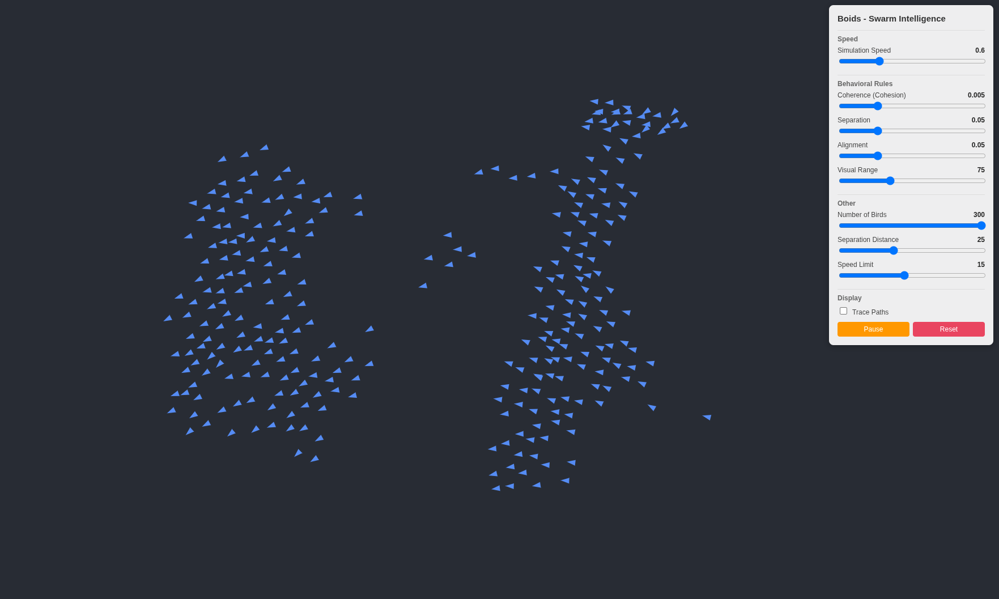
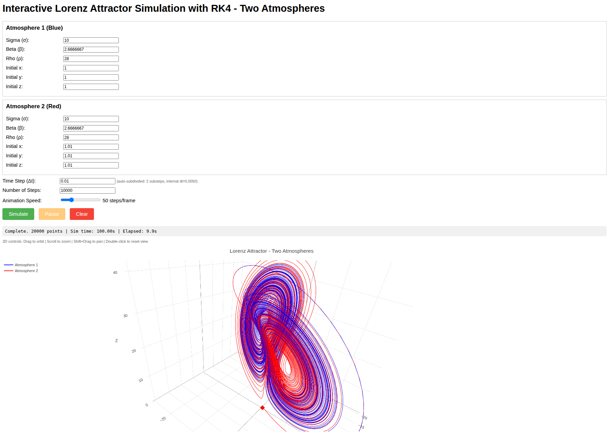

# Emergence and Chaos

> **Educational resource.** This repository is intended for teaching and learning.
> It collects two interactive simulations that illustrate how simple, local rules
> can give rise to complex, *emergent* collective behavior — and how deterministic
> systems can nonetheless be *chaotic*.

These materials are part of an exercise on emergence in complex systems
(originally developed in the context of an experimental & synthetic biology course).
Each simulation is self-contained and runs in a web browser — just open the
corresponding `.html` file.

## The two simulations

### 1. Boids — Swarm Intelligence
`boids_simulation.html`

Craig Reynolds' classic **boids** model. Each agent ("boid") follows three local
rules — *separation*, *alignment*, and *cohesion* — yet the flock as a whole
exhibits coordinated, lifelike motion that no individual boid is explicitly
programmed to produce. A canonical demonstration of **emergence**.

### 2. Lorenz Attractor — Deterministic Chaos
`lorenz_attractor_2Atmospheres_2026_v2.html`

An interactive **Lorenz attractor**, integrated with RK4 and visualized with two
"atmospheres" (trajectories) started from nearly identical initial conditions.
It illustrates **sensitive dependence on initial conditions** (the "butterfly
effect") — the hallmark of deterministic chaos.

## How to use

The content is plain HTML + JavaScript and requires no installation:

1. Clone or download this repository.
2. Open either of the `.html` files in a modern web browser.

## License

Released under the [MIT License](LICENSE) — free to use, modify, and share,
including for educational purposes.

## Credits

Developed by Kourosh Salehi-Ashtiani (KSA), with assistance from AI tools
(ChatGPT and Claude).
